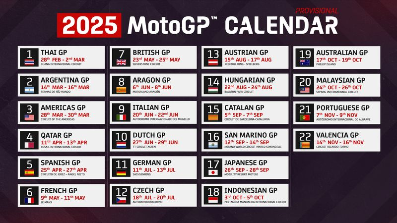
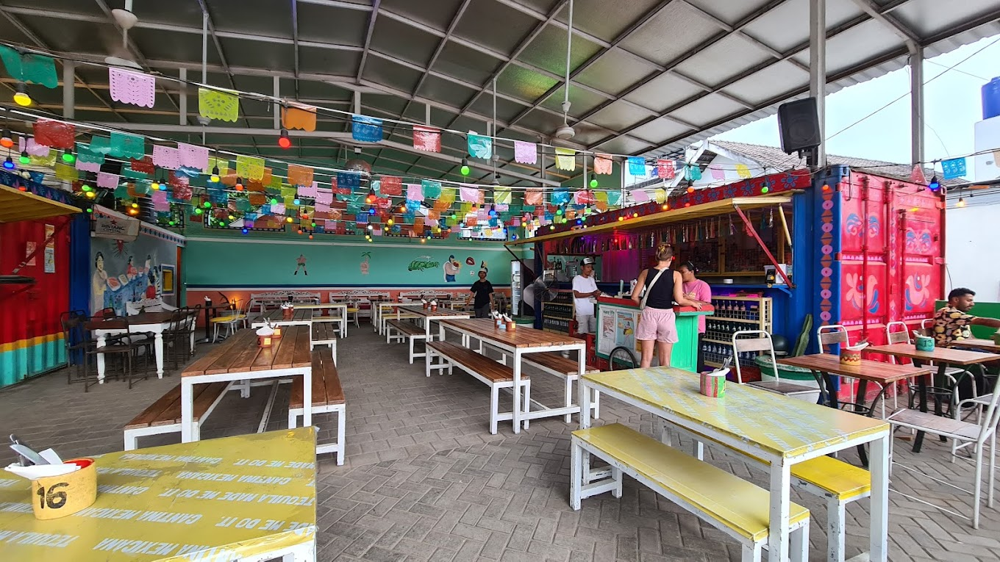
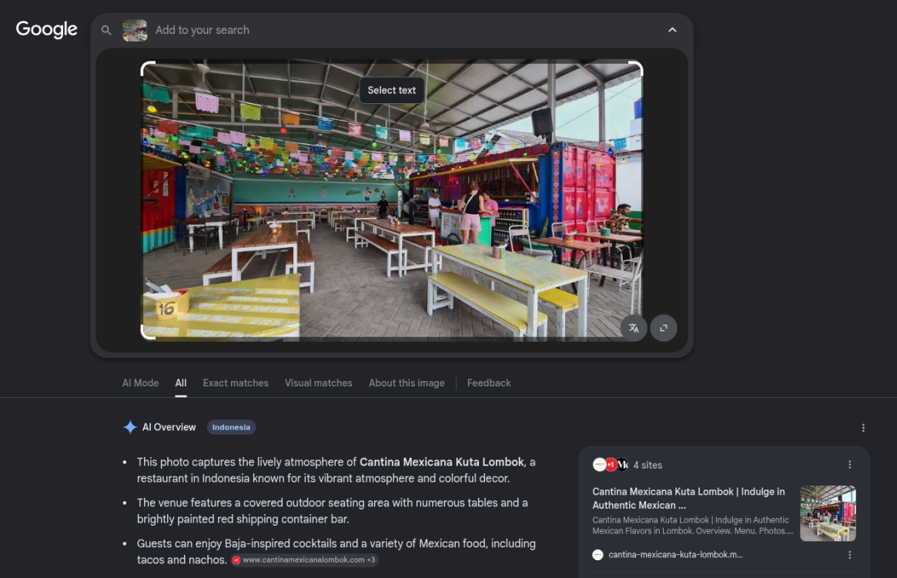
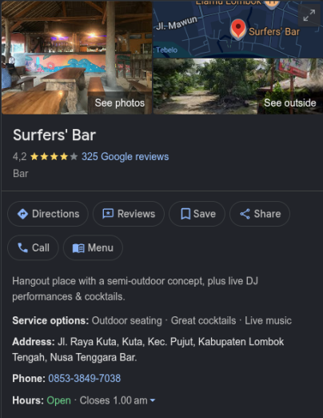
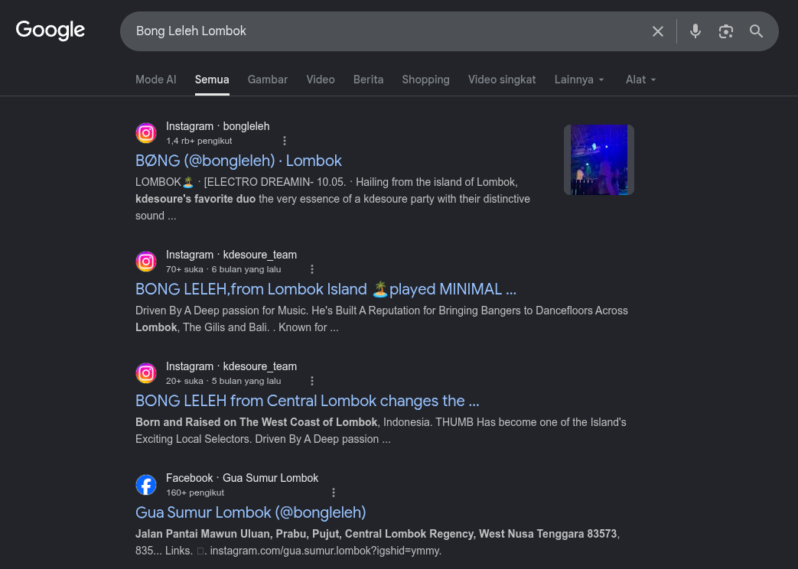
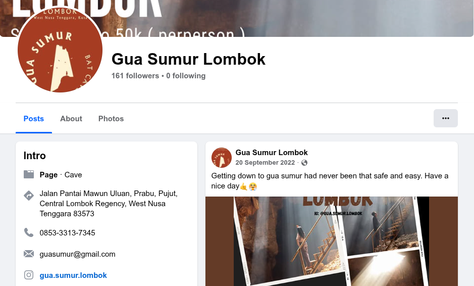

# TryHackMe: Missing Person Writeup

**Category:** OSINT

---

## 📖 Overview

**Missing Person** is an OSINT-focused challenge on TryHackMe that requires investigating a missing tourist using only publicly available information. The objective is to analyze photographs, extract metadata, perform reverse image searches, correlate social media activity, and pivot across multiple online platforms to locate the missing person's last known movements.

Unlike traditional penetration testing challenges, this room focuses entirely on Open Source Intelligence (OSINT) techniques and demonstrates how seemingly harmless public information can reveal a surprising amount of detail about an individual's activities.

---

## 🔍 Initial Investigation

After downloading the provided [ZIP archive](assets/zip/osint-1767765507985.zip), we find two image files:

```bash
7z l osint-1767765507985.zip
```
```
~/Downloads/tryhackme/missingperson
❯ 7z l osint-1767765507985.zip

7-Zip 26.01 (x64) : Copyright (c) 1999-2026 Igor Pavlov : 2026-04-27
 64-bit locale=en_US.UTF-8 Threads:12 OPEN_MAX:4096, ASM

Scanning the drive for archives:
1 file, 416387 bytes (407 KiB)

Listing archive: osint-1767765507985.zip

--
Path = osint-1767765507985.zip
Type = zip
Physical Size = 416387

   Date      Time    Attr         Size   Compressed  Name
------------------- ----- ------------ ------------  ------------------------
2026-01-06 16:42:35 .....        80858        80332  MotoGP.jpg
2026-01-06 16:08:50 .....       335765       335741  food.jpg
------------------- ----- ------------ ------------  ------------------------
2026-01-06 16:42:35             416623       416073  2 files

~/Downloads/tryhackme/missingperson
❯
```
Output:

```text
MotoGP.jpg
food.jpg
```

These two images become our primary evidence sources.

---

## 🏍️ Question 1 - Identify the Circuit

The first image contains a photograph taken at a MotoGP racing venue.


Using reverse image search and visible landmarks, the location can be identified as:

**Pertamina Mandalika International Street Circuit**

This answer is accepted by the challenge.

---

## 📅 Question 2 - Determine When the Event Took Place

The image itself contains no GPS information, so the next step is correlating the venue with the MotoGP 2025 calendar.



The 2025 MotoGP schedule shows:

```text
Indonesian GP
03 October 2025 - 05 October 2025
```

Therefore the answer is:

```text
03-05/10/2025
```

---

## 🌮 Question 3 - Identify the Mexican Restaurant

The second image shows the interior of a colorful Mexican restaurant.



A reverse image search using Google Lens reveals an exact visual match with:



**Cantina Mexicana**

Located in Kuta, Lombok.

Answer:

```text
Cantina Mexicana
```

---

## 🕒 Question 4 - Determine the Time the Photo Was Taken

The image metadata contains EXIF information.

Command:

```bash
exiftool food.jpg
```
```
~/Downloads/tryhackme/missingperson
❯ exiftool food.jpg
ExifTool Version Number         : 13.55
File Name                       : food.jpg
Directory                       : .
File Size                       : 336 kB
File Modification Date/Time     : 2026:01:06 16:08:50+07:00
File Access Date/Time           : 2026:01:06 20:20:06+07:00
File Inode Change Date/Time     : 2026:05:29 15:52:37+07:00
File Permissions                : -rw-r--r--
File Type                       : JPEG
File Type Extension             : jpg
MIME Type                       : image/jpeg
JFIF Version                    : 1.01
Resolution Unit                 : None
X Resolution                    : 1
Y Resolution                    : 1
Exif Byte Order                 : Big-endian (Motorola, MM)
Exif Version                    : 0220
Date/Time Original              : 2025:10:05 19:55:30
Image Width                     : 1360
Image Height                    : 765
Encoding Process                : Baseline DCT, Huffman coding
Bits Per Sample                 : 8
Color Components                : 3
Y Cb Cr Sub Sampling            : YCbCr4:2:0 (2 2)
Image Size                      : 1360x765
Megapixels                      : 1.0

~/Downloads/tryhackme/missingperson
❯
```
Output:

```text
Date/Time Original : 2025:10:05 19:55:30
```

Answer:

```text
19:55:30
```

---

## 🎉 Question 5 - Locate the MotoGP After Party

The challenge provides an additional clue:

> "Went to this cool MotoGP after party and became friends with one of the local DJs who played that night."

Searching for:

```text
MotoGP after party Lombok 5 October 2025
```


eventually leads to an Instagram post from [Surfers Bar Lombok](https://www.instagram.com/reel/DOcVqWAEznb/) advertising an official MotoGP after-party event.

The venue address listed on Google Maps is:



```text
Jl. Raya Kuta, Kuta, Kec. Pujut, Kabupaten Lombok Tengah, Nusa Tenggara Barat
```

Answer:

```text
Jl. Raya Kuta, Kuta, Kec. Pujut, Kabupaten Lombok Tengah, Nusa Tenggara Barat
```

---

## 🎧 Question 6 - Identify the DJ

The Instagram promotional poster lists several DJs performing that night.


One of the local DJs advertised is:

```text
Bong Leleh
```

Answer:

```text
Bong Leleh
```

---

## 🕳️ Question 7 - Find the Cave

The next step is pivoting from the DJ's online presence.

Searching:

```text
Bong Leleh Lombok
```



reveals social media accounts associated with the DJ.

Further investigation shows links to a tourism business promoting cave tours.

One of the promoted attractions is:

```text
Gua Sumur
```



Answer:

```text
Gua Sumur
```

---

## 📞 Question 8 - Recover the Business Phone Number

The Gua Sumur social media page lists contact information for tour bookings.

The phone number displayed is:

```text
085333137345
```

Answer:

```text
085333137345
```

---

## 🚩 Final Answers

| Question     | Answer                                                                        |
| ------------ | ----------------------------------------------------------------------------- |
| Circuit Name | Pertamina Mandalika International Street Circuit                              |
| Event Date   | 03-05/10/2025                                                                 |
| Restaurant   | Cantina Mexicana                                                              |
| Photo Time   | 19:55:30                                                                      |
| Bar Address  | Jl. Raya Kuta, Kuta, Kec. Pujut, Kabupaten Lombok Tengah, Nusa Tenggara Barat |
| DJ Name      | Bong Leleh                                                                    |
| Cave         | Gua Sumur                                                                     |
| Phone Number | 085333137345                                                                  |

---

## 🎯 Conclusion

This room demonstrates how powerful Open Source Intelligence can be when multiple sources are correlated together. Starting with only two photographs, it was possible to reconstruct a detailed timeline of a person's activities by combining:

* Reverse image searching
* EXIF metadata analysis
* Event correlation
* Social media investigation
* Business intelligence gathering
* Cross-platform identity pivoting

The challenge highlights how publicly available information can expose significant details about an individual's movements and associations, emphasizing both the value of OSINT and the importance of maintaining operational security online.
