# TryHackMe: W1seGuy Writeup

**Category:** Web Exploitation, Privilege Escalation

---

## 📖 Overview
**Pickle Rick** is a popular, Rick and Morty-themed CTF challenge on TryHackMe. The objective is to exploit a web server to find three hidden ingredients that will help Rick change back into a human. This challenge demonstrates fundamental penetration testing phases, including directory enumeration, source code inspection, command injection filtering bypass, and Linux privilege escalation.

## 🔍 Phase 1: Reconnaissance & Enumeration

### 1. Source Code Inspection
Navigating to the target web application (`http://10.49.131.58`), we find a basic landing page. Inspecting the HTML source code reveals an explicit comment left by the developer containing a username:

```bash
curl http://10.49.131.58
```
```html
<!DOCTYPE html>
<html lang="en">
<head>
  <title>Rick is sup4r cool</title>
  <meta charset="utf-8">
  <meta name="viewport" content="width=device-width, initial-scale=1">
  <link rel="stylesheet" href="assets/bootstrap.min.css">
  <script src="assets/jquery.min.js"></script>
  <script src="assets/bootstrap.min.js"></script>
  <style>
  .jumbotron {
    background-image: url("assets/rickandmorty.jpeg");
    background-size: cover;
    height: 340px;
  }
  </style>
</head>
<body>

  <div class="container">
    <div class="jumbotron"></div>
    <h1>Help Morty!</h1></br>
    <p>Listen Morty... I need your help, I've turned myself into a pickle again and this time I can't change back!</p></br>
    <p>I need you to <b>*BURRRP*</b>....Morty, logon to my computer and find the last three secret ingredients to finish my pickle-reverse potion. The only problem is,
    I have no idea what the <b>*BURRRRRRRRP*</b>, password was! Help Morty, Help!</p></br>
  </div>

  <!--

    Note to self, remember username!

    Username: R1ckRul3s

  -->

</body>
</html>
```
- Discovered Username: `R1ckRul3s`

### 2. Directory Brute-Forcing
To identify hidden endpoints and administrative panels, gobuster was executed using the common.txt wordlist from SecLists, targeting common web extensions (`.php, .txt, .html`):

```bash
gobuster dir --url http://10.49.131.58 --wordlist /usr/share/seclists/Discovery/Web-Content/common.txt -x php,txt,html
```
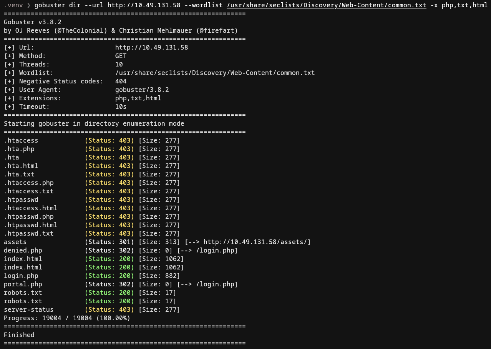

Key Discoveries:

- `/login.php (Status: 200)` - An authentication portal.
- `/portal.php (Status: 302)` - Redirects to login, likely the authenticated dashboard.
- `/robots.txt (Status: 200)` - A standard web crawler configuration file.

### 3. Reviewing robots.txt
Inspecting the contents of `http://10.49.131.58/robots.txt` reveals a single string:
```bash
curl http://10.49.131.58/robots.txt
```
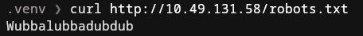

Given the lack of other clear entry points, this string highly likely serves as the password for the discovered username.

## 🚪 Phase 2: Initial Access
Using the gathered credentials, we authenticate via `/login.php`:

- Username: `R1ckRul3s`
- Password: `Wubbalubbadubdub`

Upon successful authentication, the application redirects to the Command Panel (`/portal.php`), which features an interactive input field designed to execute system commands directly on the server.

## ⚡ Phase 3: Exploitation & Filter Bypass
### 🧄 Ingredient 1: Web Root Directory
Executing the ls command within the Command Panel lists the contents of the current working directory (/var/www/html):
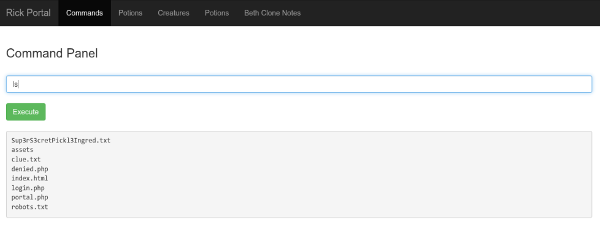

When attempting to read the ingredient using the standard `cat` utility (`cat Sup3rS3cretPickl3Ingred.txt`), the web application returns an error: Command disabled. The server implements a denylist filter targeting explicit commands like `cat`.

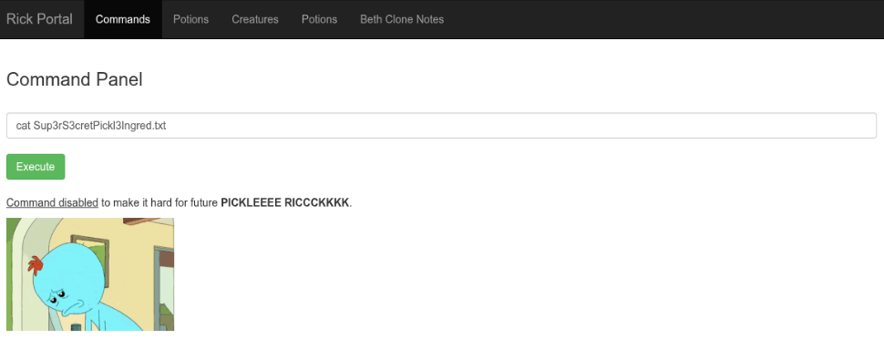

To bypass this input validation restriction, i use `curl` command.
```bash
curl http://10.49.131.58/Sup3rS3cretPickl3Ingred.txt
```

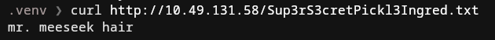

- Output / Ingredient 1: `mr. meeseek hair`

### 🧅 Ingredient 2: File System Exploration
Next, we inspect clue.txt to find directions for the remaining ingredients:
```bash
curl http://10.49.131.58/clue.txt
```

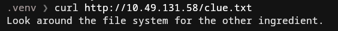

- Output: `Look around the file system for the other ingredient.`

Following the hint, we list the system's home directories to locate user accounts `ls -la /home`.

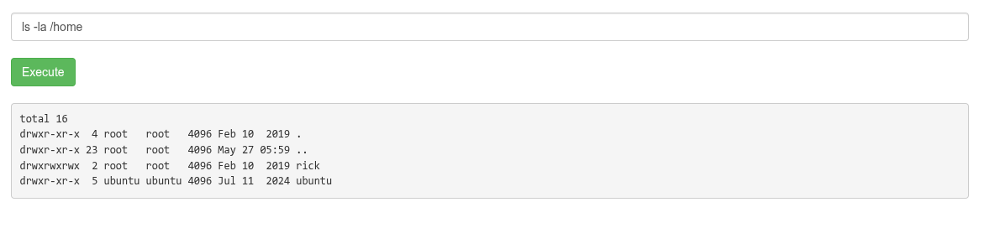

The output shows two user directories: `ubuntu` and `rick`. Listing the contents of Rick's home directory reveals the second ingredient, `ls -la /home/rick`

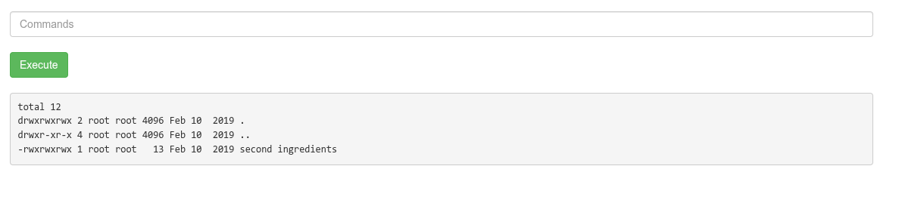

- Discovered File: `second ingredients`

Because the filename contains a space and the `cat` command remains restricted, we wrap the absolute path in double quotes and invoke `less`:
`less "/home/rick/second ingredients"`

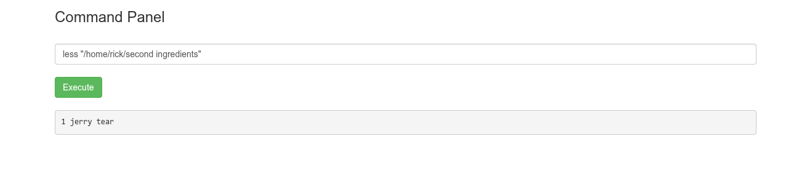

- Output / Ingredient 2: `1 jerry tear`

## 👑 Phase 4: Privilege Escalation
### 🥒 Ingredient 3: Root Directory Access
To capture the final ingredient, we need to inspect administrative locations, typically restricted to the `root` user. First, we evaluate the current user's privileges within the `sudoers` configuration:
`sudo -l`

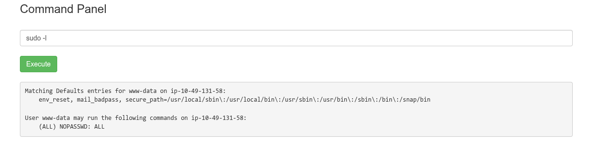

This misconfiguration is a critical flaw. The `www-data` service account can execute any command with full superuser privileges without supplying a password.

We leverage this misconfiguration to list the `/root` directory securely:
`sudo ls -la /root`

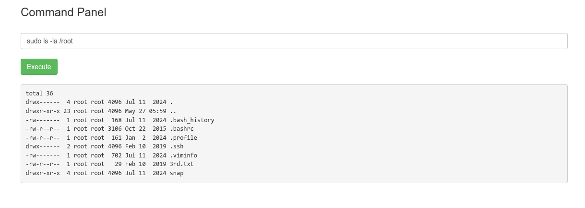

- Discovered File: `3rd.txt`

Finally, we read the contents of the third ingredient file by combining `sudo` with our filter-bypass command (`less`):
`sudo less /root/3rd.txt`

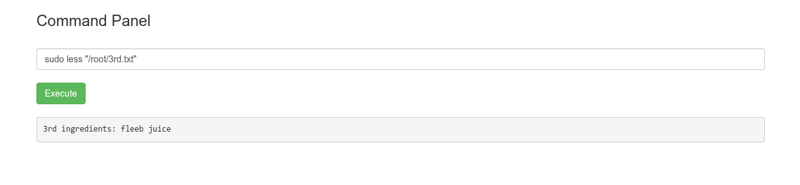

- Output / Ingredient 3: `fleeb juice`

## 🎯 Conclusion
- The Pickle Rick environment was fully compromised due to a chain of multiple security vulnerabilities:
- Information Disclosure: Sensitive administrative credentials (username) were left directly inside public HTML comments.
- Weak Credential Management: The account password was stored within `robots.txt`, a publicly accessible directory mapping file.
- Remote Command Execution (RCE): The application exposed an unauthenticated/insufficiently protected system terminal.
- Flawed Input Filtering: The server relied on a simple denylist approach (`cat` restriction), which was trivially bypassed using equivalent utilities (`less`).
- Insecure Sudo Configuration: Granting full `NOPASSWD: ALL` privileges to a low-privilege service account (`www-data`) allowed immediate and total system takeover.