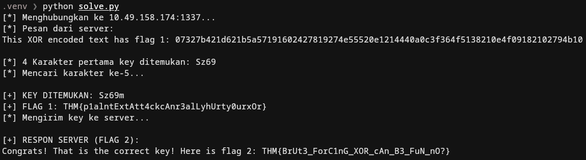

# TryHackMe: W1seGuy Writeup

**Category:** Cryptography

---

## 📖 Overview
**W1seGuy** is a cryptography-focused challenge on TryHackMe that requires exploiting a custom XOR encryption implementation. By analyzing the provided source code, we can identify a vulnerability in how the encryption key is generated and applied. Utilizing a **Known-Plaintext Attack (KPA)** combined with a localized brute-force approach, we can retrieve the encryption key and decrypt the flags without needing to brute-force the entire keyspace.

## 🔍 Code Review & Vulnerability Analysis
We are provided with a Python script (`source.py`) that runs on the target server. Let's analyze the core encryption logic:

```python
import random
import socketserver
import socket, os
import string

flag = open('flag.txt','r').read().strip()

def send_message(server, message):
    enc = message.encode()
    server.send(enc)

def setup(server, key):
    flag = 'THM{thisisafakeflag}'
    xored = ""

    for i in range(0,len(flag)):
        xored += chr(ord(flag[i]) ^ ord(key[i%len(key)]))

    hex_encoded = xored.encode().hex()
    return hex_encoded

def start(server):
    res = ''.join(random.choices(string.ascii_letters + string.digits, k=5))
    key = str(res)
    hex_encoded = setup(server, key)
    send_message(server, "This XOR encoded text has flag 1: " + hex_encoded + "\n")

    send_message(server,"What is the encryption key? ")
    key_answer = server.recv(4096).decode().strip()

    try:
        if key_answer == key:
            send_message(server, "Congrats! That is the correct key! Here is flag 2: " + flag + "\n")
            server.close()
        else:
            send_message(server, 'Close but no cigar' + "\n")
            server.close()
    except:
        send_message(server, "Something went wrong. Please try again. :)\n")
        server.close()

class RequestHandler(socketserver.BaseRequestHandler):
    def handle(self):
        start(self.request)

if __name__ == '__main__':
    socketserver.ThreadingTCPServer.allow_reuse_address = True
    server = socketserver.ThreadingTCPServer(('0.0.0.0', 1337), RequestHandler)
    server.serve_forever()`
```

### Key Findings:
1. Encryption Algorithm: The server uses an XOR cipher.
2. Key Generation: The key is strictly 5 characters long and consists only of alphanumeric characters (string.ascii_letters + string.digits).  
3. The Vulnerability: XOR encryption is reversible. The mathematical property of XOR dictates that if Ciphertext ($C$) is generated by XORing Plaintext ($P$) with a Key ($K$), then $C \oplus P = K$.  

Because this is a TryHackMe challenge, we inherently know that the plaintext flag starts with the standard format `THM{`. This gives us a 4-byte known plaintext.

## ⚔️ Exploitation Strategy (Known-Plaintext Attack)
Instead of brute-forcing all possible 5-character alphanumeric combinations ($62^5 = 916,132,832$ possibilities), we can significantly reduce the complexity:
1. Extract the first 4 bytes of the Key: We intercept the hex-encoded ciphertext from the server and XOR the first 4 bytes with our known plaintext (`THM{`). This instantly reveals the first 4 characters of the key.
2. Brute-force the 5th byte: Since the key is 5 characters long, we only need to guess the final character. We can iterate through the 62 possible alphanumeric characters, append each to our known 4-character key, and attempt to decrypt the ciphertext.
3. Validation: The correct key will yield a decrypted string that ends with a closing curly brace `}`.

## 💻 Exploit Script
`solve.py`
```python
import socket
import string

# Sesuaikan IP dengan IP Target Machine di TryHackMe
HOST = '10.49.158.174'
PORT = 1337

def solve():
    print(f"[*] Menghubungkan ke {HOST}:{PORT}...")
    s = socket.socket(socket.AF_INET, socket.SOCK_STREAM)
    s.connect((HOST, PORT))

    # 1. Terima pesan pembuka dari server
    data = s.recv(4096).decode()
    print("[*] Pesan dari server:\n" + data)

    # 2. Ekstrak string hex dari pesan server
    # Format pesan: "This XOR encoded text has flag 1: <hex_string>\n"
    hex_encoded = data.split('flag 1: ')[1].split('\n')[0].strip()
    ciphertext = bytes.fromhex(hex_encoded)

    # 3. Cari 4 karakter pertama dari key (Known Plaintext Attack)
    known_plaintext = b'THM{'
    key_part = ""
    for i in range(4):
        key_part += chr(ciphertext[i] ^ known_plaintext[i])

    print(f"[*] 4 Karakter pertama key ditemukan: {key_part}")

    # 4. Brute-force karakter ke-5 dari key
    possible_chars = string.ascii_letters + string.digits
    found_key = None
    flag_1 = ""

    print("[*] Mencari karakter ke-5...")
    for char in possible_chars:
        test_key = key_part + char
        decrypted = ""

        # Coba dekripsi ciphertext dengan test_key
        for i in range(len(ciphertext)):
            decrypted += chr(ciphertext[i] ^ ord(test_key[i % 5]))

        # Flag yang benar pasti diakhiri dengan '}'
        if decrypted.endswith('}'):
            found_key = test_key
            flag_1 = decrypted
            break

    if found_key:
        print(f"\n[+] KEY DITEMUKAN: {found_key}")
        print(f"[+] FLAG 1: {flag_1}")

        # 5. Kirim key ke server untuk mendapatkan Flag 2
        # Biasanya server mengirim prompt "What is the encryption key?"
        prompt = s.recv(1024).decode()

        print(f"[*] Mengirim key ke server...")
        s.sendall((found_key + '\n').encode())

        # 6. Terima Flag 2
        response = s.recv(4096).decode()
        print(f"\n[+] RESPON SERVER (FLAG 2):\n{response}")
    else:
        print("[-] Gagal menemukan key.")

    s.close()

if __name__ == '__main__':
    solve()
```

## 🚩 Execution & Results
Running the script successfully breaks the encryption in a fraction of a second:


### Flags Captured:
- Flag 1: `THM{p1alntExtAtt4ckcAnr3alLyhUrty0urxOr}`
- Flag 2: `THM{BrUt3_ForC1nG_XOR_cAn_B3_FuN_nO?}`

## 🎯 Conclusion
This challenge highlights the dangers of using simple XOR encryption with short, repeating keys. By understanding the underlying mathematics of the cipher, we bypassed the need for heavy computational brute-forcing and efficiently cracked the encryption using a Known-Plaintext Attack.